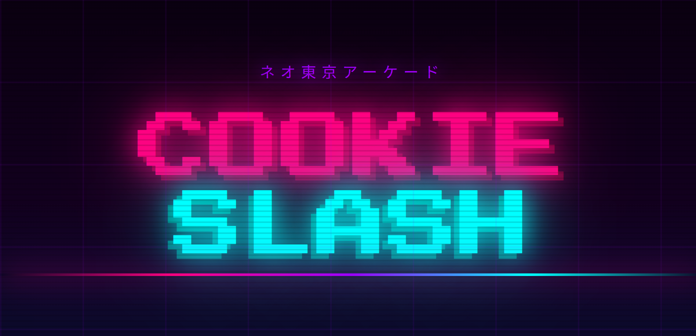

# Cookie Slasher

## Description

Cookie Slasher is a slasher game where you appears in Tokyo in 2077 and you need to slash cookies to survive before they get you.

## Features

- Slash cookies
- Dodge bombs
- Collect golden cookies
- Fight bosses
- Upgrade your character

## Installation

```bash
pnpm install
```

## Usage

```bash
pnpm run dev
```

## License

This project is licensed under the MIT License - see the [LICENSE](LICENSE) file for details.
